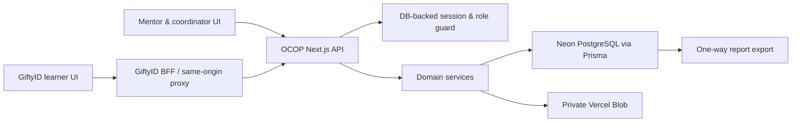

# Kiến trúc

## Ranh giới hệ thống

PostgreSQL là nguồn sự thật duy nhất cho identity của chương trình, tiến độ, bài nộp, review, gate, audit và chứng chỉ. Google Sheets chỉ được phép nhận bản xuất báo cáo một chiều.

## Quy tắc dữ liệu

- Một repo duy nhất sở hữu `prisma/schema.prisma` và migration.
- Giáo trình có `ProgramVersion`; cohort luôn trỏ vào một version cụ thể.
- Draft dùng `version`; client gửi `expectedVersion`. Sai version trả `409`.
- Mutation quan trọng dùng UUID `idempotencyKey`; cùng key khác payload trả `409`.
- Submission đã gửi không đồng nghĩa đã đạt. Chỉ review `ACCEPT` mới tăng accepted progress.
- Gate chỉ được `ACCEPTED` khi toàn bộ task thuộc gate đã đạt.
- Chứng chỉ lưu snapshot và hash; dữ liệu nguồn thay đổi sau đó không viết lại lịch sử chứng chỉ.
- `AuditEvent` không lưu mật khẩu, token, file hoặc nội dung khách hàng không cần thiết.

## Trust boundary

- Role và actor luôn lấy từ session phía server.
- Learner không được truyền `userId`/`enrollmentId` để tự mở rộng phạm vi.
- Evidence là private blob. API kiểm tra owner/role rồi mới stream file.
- URL blob thô không xuất hiện trong learner API.
- Public certificate API chỉ trả trường xác minh an toàn, không trả submission payload.

## Triển khai

- Runtime dùng pooled `DATABASE_URL` của Neon.
- Migration dùng `DIRECT_URL` và `prisma migrate deploy`.
- Preview/staging nên dùng Neon branch riêng.
- CI không kết nối production DB ở pull request.
